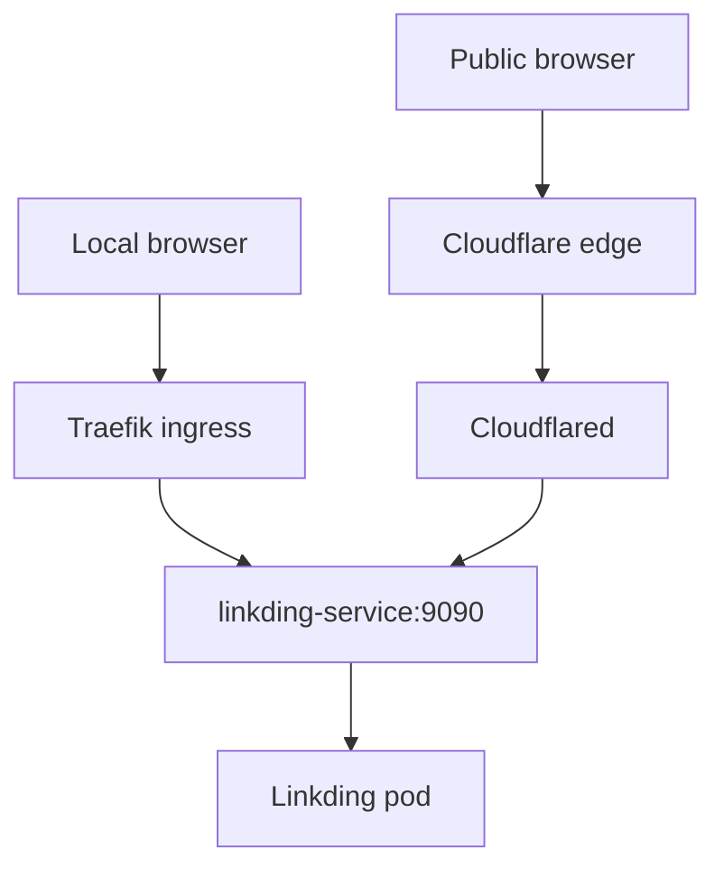

# Linkding

Linkding is the bookmark application and the first workload exposed publicly
through the Cloudflare Tunnel.

## Current implementation

| Property | Value |
|---|---|
| Image | `sissbruecker/linkding:1.45.0` |
| Namespace | `linkding` |
| Service | `linkding-service:9090` |
| Local hostname | `linkding.homelab.internal` |
| Public hostname | `linkding.hyperoot.dev` |
| Replicas | 1 |
| Persistence | 10 GiB retained local volume |

The container runs as UID/GID `33`, drops Linux capabilities, and mounts its
data at `/etc/linkding/data`. Its PVC requests the `local-path` StorageClass;
the provisioner creates a node-affine PV on the dedicated Talos XFS user volume
with a `Retain` reclaim policy.

## Create the initial superuser

After the Linkding pod is running, create the first superuser interactively:

```shell
kubectl exec --interactive --tty \
  --namespace linkding \
  deployment/linkding-deployment \
  -- python manage.py createsuperuser
```

Follow the prompts to enter the username, email address, and password, then sign
in through the local or public Linkding URL. The account is written to the
persistent Linkding database and survives pod restarts. Do not store the
credentials in Git.

The command targets the Deployment instead of a generated pod name, so it keeps
working after Kubernetes replaces or rolls out the pod.

## Request paths



## Repository locations

- Reusable workload: `gitops/apps/base/linkding`
- Lab storage and ingress: `gitops/apps/lab/linkding`
- Public tunnel route: `gitops/infrastructure/configs/lab/cloudflared/config.yaml`
- Activation: `gitops/apps/lab/kustomization.yaml`

## Dependencies

- Traefik and MetalLB provide local access.
- Cloudflared provides public access.
- Vault and External Secrets provide the tunnel credential to Cloudflared.

See [Traffic flow](../architecture/traffic-flow.md) for the complete request
path.

## References

- [Linkding](https://linkding.link/)
- [Linkding on GitHub](https://github.com/sissbruecker/linkding)
