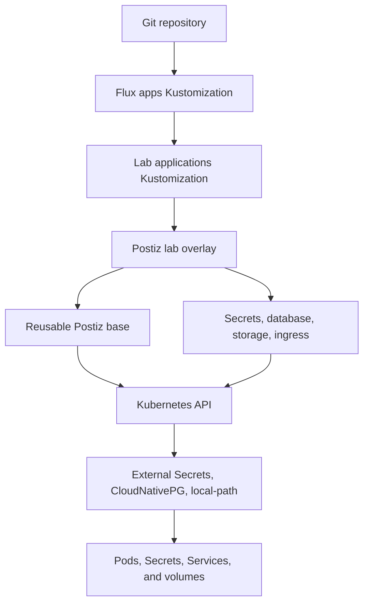
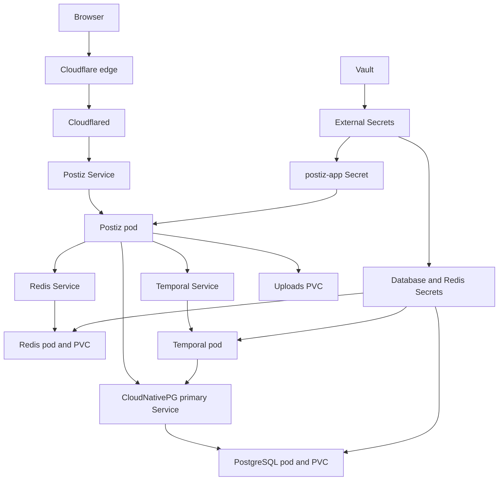

# Postiz Architecture

Postiz is assembled from a reusable base and a lab-specific overlay. Flux
starts at the cluster activation file, Kustomize follows the resource lists,
and Kubernetes plus the installed operators create the running workloads.

The Postiz overlay renders 18 Kubernetes objects:

| Kind | Count | Responsibility |
|---|---:|---|
| `Namespace` | 1 | Isolate Postiz resources |
| `Deployment` | 3 | Run Postiz, Redis, and Temporal |
| `Service` | 3 | Give those workloads stable network addresses |
| `ConfigMap` | 1 | Supply Temporal dynamic configuration |
| `ExternalSecret` | 4 | Deliver Vault values to each consumer |
| `PersistentVolumeClaim` | 2 | Retain uploads and Redis data |
| `Cluster` | 1 | Ask CloudNativePG to manage PostgreSQL |
| `Database` | 2 | Create the Temporal persistence databases |
| `Ingress` | 1 | Provide local Traefik access |

Kustomization and Cloudflared configuration files participate in deployment
but do not become objects in this count.

## Reconciliation chain



### `gitops/clusters/lab/apps.yaml`

This Flux `Kustomization` is the activation point. Every minute it renders
`gitops/apps/lab`, applies the result, and prunes objects that it previously
managed but that no longer exist in Git. It waits for `infrastructure-configs`
so the shared operators and secret store are ready first.

If this file stops targeting `gitops/apps/lab`, none of the application
overlays in that folder reconcile.

### `gitops/apps/lab/kustomization.yaml`

This is the lab application catalog. Its `postiz` resource entry makes the
Postiz overlay reachable from the Flux activation point. Removing that entry
removes Postiz from the rendered application set.

### `gitops/apps/lab/postiz/kustomization.yaml`

This assembles the complete installation. It imports
`gitops/apps/base/postiz` and adds the lab's Vault integration, PostgreSQL
cluster, logical databases, volume sizes, and local Ingress.

### `gitops/apps/base/postiz/kustomization.yaml`

This assembles the reusable workloads: the namespace, Postiz, Redis, and
Temporal. It contains no lab-specific storage sizes, Vault references, or
Ingress hostname.

## Application workload

### `gitops/apps/base/postiz/namespace.yaml`

Creates the `postiz` namespace. Every Postiz resource is placed there so its
names, Secrets, Services, and workloads remain separate from other
applications.

### `gitops/apps/base/postiz/deployment.yaml`

Runs one `ghcr.io/gitroomhq/postiz-app:v2.21.7` container. The image contains
the frontend, backend, Nginx, and Temporal orchestrator processes.

The Deployment is responsible for:

- setting `postiz.hyperoot.dev` as the canonical frontend, backend, and OAuth
  URL;
- locating Temporal at `postiz-temporal:7233`;
- loading database, Redis, JWT, and LinkedIn values from the `postiz-app`
  Secret;
- disabling registration and enabling secure-cookie behavior;
- mounting the uploads PVC at `/uploads`;
- providing temporary `/config` and Nginx runtime directories;
- defining startup, readiness, and liveness probes; and
- setting CPU and memory requests and limits.

The `Recreate` strategy stops the existing pod before starting its replacement.
This avoids two replicas competing for the same `ReadWriteOnce` uploads volume.

Without this file the dependencies may remain healthy, but the Postiz
application does not run.

### `gitops/apps/base/postiz/service.yaml`

Creates the stable internal address
`postiz.postiz.svc.cluster.local:5000`. Traefik and Cloudflared use this Service
instead of a pod IP, which changes whenever the pod is replaced.

## Redis

### `gitops/apps/base/postiz/redis-deployment.yaml`

Runs one password-protected Redis instance. Postiz uses Redis for short-lived
state, caching, rate limiting, and queue-related coordination. Append-only
persistence is enabled and `/data` is mounted from the Redis PVC.

The container runs as a non-root user, drops Linux capabilities, and uses the
password delivered in the `postiz-redis` Secret. `Recreate` prevents two Redis
pods from using the same `ReadWriteOnce` volume during an update.

### `gitops/apps/base/postiz/redis-service.yaml`

Creates `postiz-redis.postiz.svc.cluster.local:6379`. The `REDIS_URL` generated
for Postiz points to this address.

### `gitops/apps/lab/postiz/redis-persistent-volume-claim.yaml`

Requests 1 GiB from the `local-path` StorageClass. Redis mounts the resulting
volume at `/data`, allowing its append-only file to survive pod replacement and
node reboot.

### `gitops/apps/lab/postiz/redis-external-secret.yaml`

Reads `redis-password` from the Vault `postiz` object and creates the
`postiz-redis` Kubernetes Secret. Redis uses the value for `--requirepass`.
The application ExternalSecret reads the same Vault property when constructing
`REDIS_URL`, keeping both consumers synchronized.

## Temporal

### `gitops/apps/base/postiz/temporal-deployment.yaml`

Runs `temporalio/auto-setup:1.28.4`. Temporal provides durable scheduling,
workflow state, retries, timers, and background task distribution for Postiz.

It connects to the CloudNativePG primary Service and uses:

- `temporal` for workflow histories, execution state, tasks, and metadata;
- `temporal_visibility` for listing, filtering, and searching workflows; and
- the `temporal` PostgreSQL role supplied by the
  `postiz-temporal-database` Secret.

`SKIP_DB_CREATE=true` leaves database creation to CloudNativePG. The auto-setup
image still prepares the Temporal schemas inside those databases. The
Deployment exposes the Temporal gRPC frontend on port 7233.

### `gitops/apps/base/postiz/temporal-service.yaml`

Creates `postiz-temporal.postiz.svc.cluster.local:7233`. The orchestrator inside
the Postiz container connects to this Service.

### `gitops/apps/base/postiz/temporal-config-map.yaml`

Provides the dynamic configuration file mounted into the Temporal container.
The current setting permits Temporal identifiers up to 255 characters.

### `gitops/apps/lab/postiz/temporal-database.yaml`

Asks CloudNativePG to create the `temporal` database in `postiz-postgres` and
assign ownership to the `temporal` role. Its reclaim policy retains the
database if this Kubernetes object is accidentally deleted.

### `gitops/apps/lab/postiz/temporal-visibility-database.yaml`

Creates the `temporal_visibility` database with the same owner and retention
behavior. This installation uses PostgreSQL visibility instead of deploying
Elasticsearch.

### `gitops/apps/lab/postiz/temporal-database-external-secret.yaml`

Reads `temporal-database-password` from Vault and creates a
`kubernetes.io/basic-auth` Secret named `postiz-temporal-database`. CloudNativePG
uses it to manage the PostgreSQL role, and Temporal uses it to authenticate.

## PostgreSQL

### `gitops/apps/lab/postiz/postgresql-cluster.yaml`

Asks the CloudNativePG operator to create one PostgreSQL 17.9 instance with
10 GiB of `local-path` storage. Bootstrap creates the `postiz` database and its
owner, while the managed-role section creates the `temporal` login role.

CloudNativePG creates additional objects that are intentionally not written as
Postiz YAML files:

- the PostgreSQL pod and PVC;
- the `postiz-postgres-rw` primary Service;
- read and read-only Services; and
- the resources required to initialize and supervise PostgreSQL.

### `gitops/apps/lab/postiz/postiz-database-external-secret.yaml`

Reads `postiz-database-password` from Vault and creates the
`postiz-database` basic-auth Secret. CloudNativePG expects this shape when
bootstrapping the `postiz` database and owner.

This Secret is separate from `postiz-app` because the database operator and
the application require different key layouts.

## Application Secrets

### `gitops/apps/lab/postiz/postiz-external-secret.yaml`

Reads five properties from the Vault `postiz` object:

- `jwt-secret`;
- `postiz-database-password`;
- `redis-password`;
- `linkedin-client-id`; and
- `linkedin-client-secret`.

It creates the `postiz-app` Secret with `JWT_SECRET`, complete `DATABASE_URL`
and `REDIS_URL` connection strings, and the two LinkedIn environment values.
The Postiz Deployment references those keys without placing secret values in
Git.

The four ExternalSecret files are separate because their consumers need
different Secret names, formats, ownership, and lifecycles:

| Generated Secret | Consumer | Shape |
|---|---|---|
| `postiz-app` | Postiz | Environment variables and connection URLs |
| `postiz-database` | CloudNativePG bootstrap | Basic authentication |
| `postiz-temporal-database` | CloudNativePG and Temporal | Basic authentication |
| `postiz-redis` | Redis | Password key |

## Upload storage

### `gitops/apps/lab/postiz/uploads-persistent-volume-claim.yaml`

Requests a 20 GiB `ReadWriteOnce` volume from `local-path`. Postiz mounts it at
`/uploads` for user-uploaded images and videos. The pod cannot start if this
claim is unavailable because its Deployment requires the volume.

## Traffic

### `gitops/apps/lab/postiz/ingress.yaml`

Provides local access through Traefik at `postiz.homelab.internal`. The path is:

```text
LAN browser -> local DNS -> MetalLB -> Traefik -> postiz Service -> Postiz pod
```

This Ingress is not part of the Cloudflare Tunnel path.

### `gitops/infrastructure/configs/lab/cloudflared/config.yaml`

Maps `postiz.hyperoot.dev` directly to
`http://postiz.postiz.svc.cluster.local:5000`. Cloudflare terminates public
HTTPS, and the Cloudflared pod forwards the request to the internal Service.

```text
Internet browser -> Cloudflare edge -> homelab tunnel -> Cloudflared
                 -> postiz Service -> Postiz pod
```

The final catch-all rule returns 404 for hostnames that have no explicit tunnel
route.

## Runtime relationships



## Why the YAML is separated

Docker Compose can place containers, volumes, networking, and environment
variables in one file. Kubernetes gives each concern its own API object so it
can be reconciled and replaced independently. In this installation:

- Deployments decide what runs;
- Services provide stable internal addresses;
- ExternalSecrets deliver credentials without storing them in Git;
- PVCs define retained storage;
- CloudNativePG objects declare PostgreSQL and logical databases;
- Ingress and Cloudflared configuration provide different traffic paths; and
- Kustomization files assemble reusable and environment-specific layers.

The Homepage entry in `gitops/apps/lab/homepage/configs/services.yaml` only adds
a dashboard link and health monitor. It is not required for Postiz to run.
