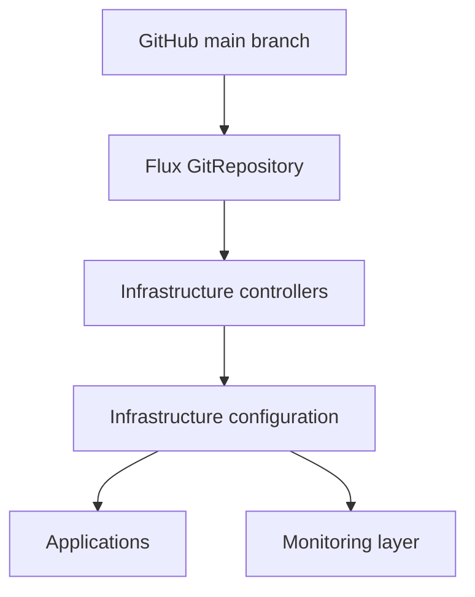

# Platform Architecture

The homelab runs on one Lenovo Legion Y540 node. Talos Linux supplies an
immutable Kubernetes host, while Flux turns the `main` branch of this
repository into the desired cluster state.

## Reconciliation layers

The order is intentional:

1. Flux installs operators and controllers.
2. Configuration custom resources are applied after their controllers exist.
3. Applications reconcile after shared infrastructure is ready.
4. Monitoring has its own layer and is currently empty by design.

## Runtime foundation

| Component | Current role |
|---|---|
| Talos Linux `v1.13.6` | Immutable operating system and Kubernetes lifecycle |
| Kubernetes `v1.36.2` | Workload scheduler and control plane |
| containerd `2.2.5` | Container runtime |
| Flannel | Pod networking |
| CoreDNS | Cluster service discovery |
| NVIDIA GPU Operator `v26.3.3` | GPU discovery, validation, metrics, and device plugin |
| Local Path Provisioner `v0.0.36` | Dynamic local PersistentVolumes on the Talos NVMe filesystem |

The initial Talos machine configuration includes the NVIDIA extensions, kernel
modules, single-node scheduling policy, and NVMe volume layout. Flux owns the
GPU Operator Helm release and Local Path Provisioner that expose those host
capabilities to Kubernetes. The boundaries are documented on the
[GPU Operator](../services/gpu-operator.md) and
[Local Path Provisioner](../services/local-path-provisioner.md) pages.

## Repository ownership

- `gitops/clusters/lab` activates the reconciliation layers.
- `gitops/apps` owns user-facing workloads.
- `gitops/infrastructure` owns shared controllers and configuration.
- `gitops/monitoring` contains the staged observability stack.
- `iac/vault` owns configuration inside Vault that Kubernetes cannot bootstrap.

Continue with [Traffic flow](traffic-flow.md), [Secrets flow](secrets-flow.md),
the [platform setup](../platform/index.md), or the
[repository structure](../gitops/repository-structure.md).
