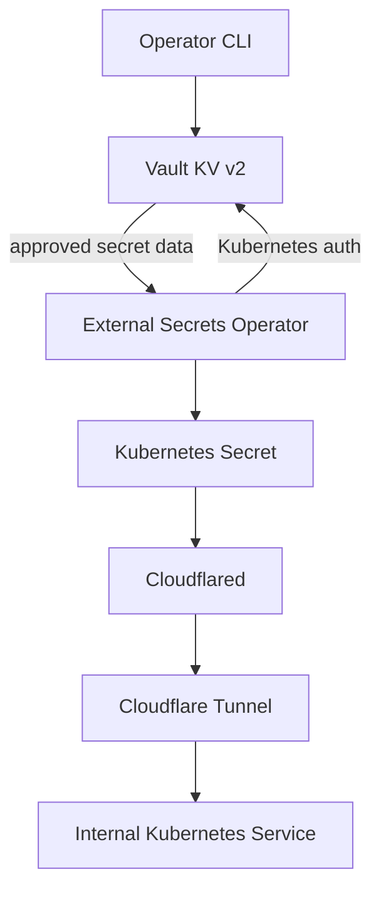

# Secrets Flow

Vault stores sensitive values outside Git. External Secrets authenticates to
Vault with Kubernetes auth, reads approved values, and creates namespaced
Kubernetes Secrets for workloads.

## Ownership boundaries

- Terraform under `iac/vault` owns Vault auth, mounts, policies, and roles.
- Operators write application secret values to Vault through the Vault CLI.
- External Secrets owns the generated Kubernetes Secret.
- Workload manifests consume the Kubernetes Secret without embedding values.
- Cloudflare owns the external tunnel endpoint and DNS routing.

## Cloudflared implementation

The Cloudflared deployment mounts the locally managed tunnel credential from a
Kubernetes Secret. Its local configuration sends requests for
`linkding.hyperoot.dev` to the Linkding Service and returns a 404 response for
unmatched hostnames.

See [Vault](../services/vault.md),
[External Secrets](../services/external-secrets.md), and
[Cloudflared](../services/cloudflared.md) for component details.
