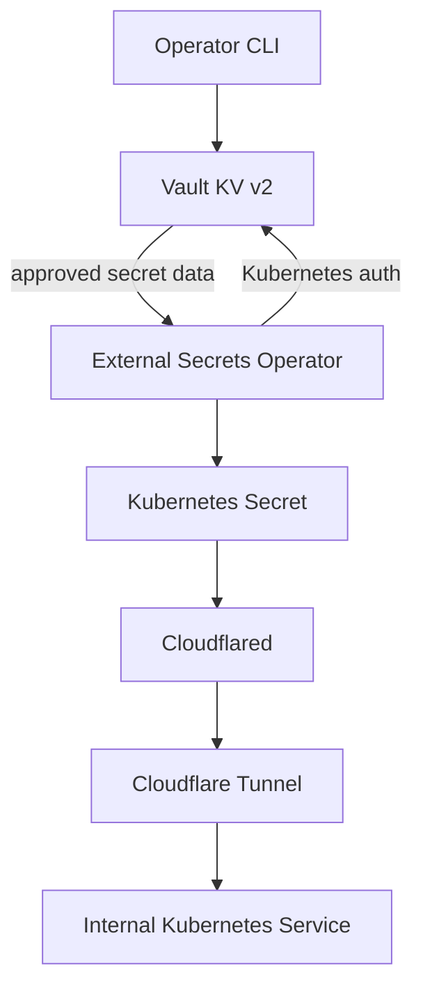

# Secrets Flow

Vault stores sensitive values outside Git. External Secrets authenticates to
Vault with Kubernetes auth, reads approved values, and creates namespaced
Kubernetes Secrets for workloads.

## Ownership boundaries

- Terraform under `iac/vault` owns Vault auth, mounts, policies, and roles.
- The operator chooses or explicitly approves every application secret value.
- Operators write approved application secret values to Vault through the
  Vault CLI.
- External Secrets owns the generated Kubernetes Secret.
- Workload manifests consume the Kubernetes Secret without embedding values.
- Cloudflare owns the external tunnel endpoint and DNS routing.

## Operator approval boundary

Declaring a Vault path in Git does not authorize creating or changing the value
at that path. Before any credential generation, Vault write, rotation,
deletion, secret read, or unseal operation, the exact action must be presented
to the operator and must receive explicit approval. The operator must first be
asked whether an existing value should be used.

Automation must not treat access to `.env`, a Vault token, or an unseal key as
permission to use it. GitOps owns references and delivery; the operator owns
the secret material and every security-sensitive mutation.

## Cloudflared implementation

The Cloudflared deployment mounts the locally managed tunnel credential from a
Kubernetes Secret. Its local configuration sends requests for
`linkding.hyperoot.dev` to the Linkding Service and returns a 404 response for
unmatched hostnames.

See [Vault](../services/vault.md),
[External Secrets](../services/external-secrets.md), and
[Cloudflared](../services/cloudflared.md) for component details.
