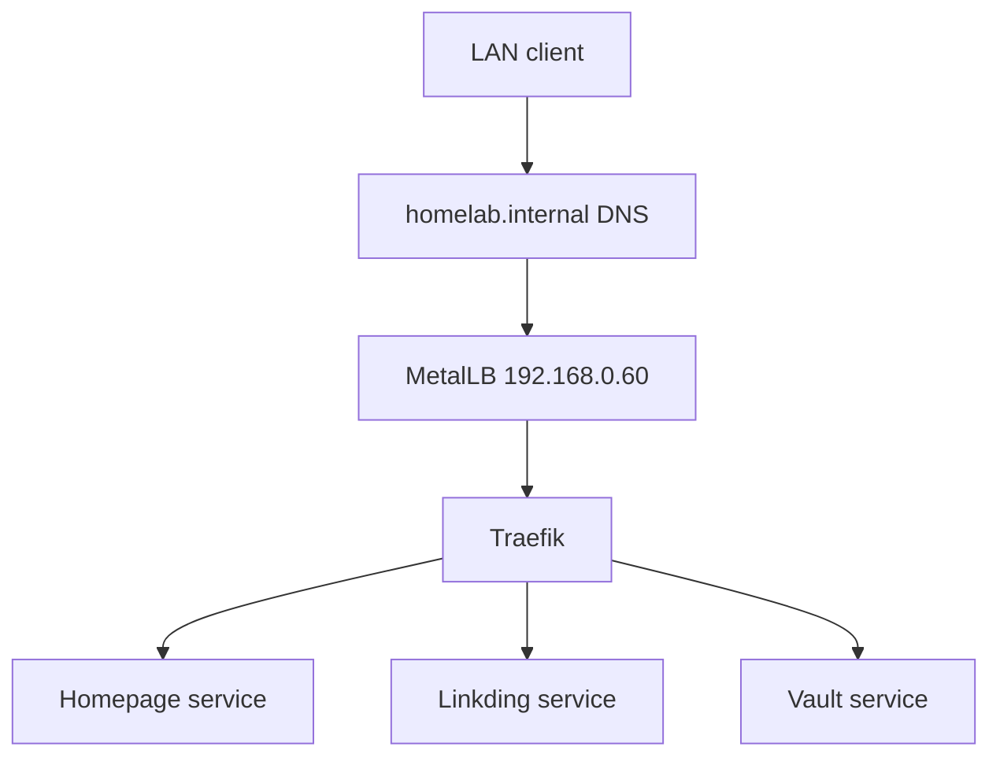
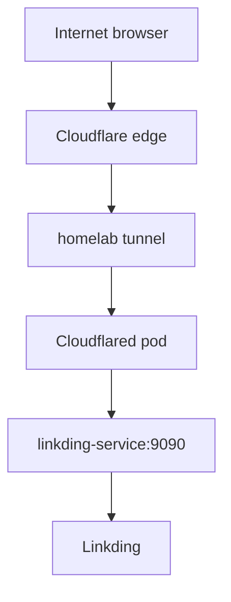

# Traffic Flow

The platform has separate paths for local ingress and public access. Both end
at ordinary Kubernetes Services; applications do not need to know which path a
request used.

## Local network

MetalLB advertises a single address, `192.168.0.60`. Traefik receives traffic
on that address and selects a backend from the request hostname.

## Public Linkding access

`linkding.hyperoot.dev` is the only public application route currently defined.
The tunnel is outbound-only, so the home router does not expose an inbound
application port.

See [MetalLB](../services/metallb.md), [Traefik](../services/traefik.md), and
[Cloudflared](../services/cloudflared.md) for ownership details.
