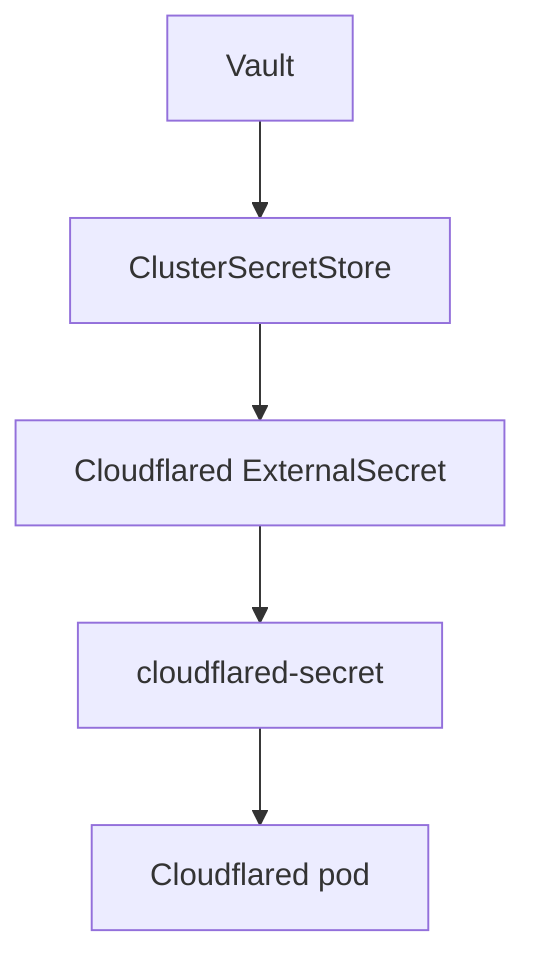

# Adding a Service

This repository uses a `base/` and `lab/` overlay pattern so we can separate reusable service definitions from lab-specific decisions.

## At a glance

```text
gitops/
├── apps/
│   ├── base/
│   │   └── linkding/
│   └── lab/
│       └── linkding/
└── infrastructure/
    └── controllers/
        ├── base/
        │   └── traefik/
        └── lab/
            └── traefik/
```

The idea is simple:

- `base/` defines the service itself
- `lab/` adapts that service for this homelab

## What goes in `base/`

`base/` should contain the reusable building blocks of the service.

For an application, that usually means things like:

- `namespace.yaml`
- `deployment.yaml`
- `service.yaml`

For Helm-managed infrastructure, that usually means things like:

- `namespace.yaml`
- `helm-repository.yaml`
- `helm-release.yaml`

Example:

```yaml
apiVersion: kustomize.config.k8s.io/v1beta1
kind: Kustomization
resources:
  - namespace.yaml
  - deployment.yaml
  - service.yaml
```

This is how `gitops/apps/base/linkding/kustomization.yaml` works.

## What goes in `lab/`

`lab/` is the environment-specific overlay.

This is where we add the things that belong to this homelab in particular:

- namespace assignment for the overlay
- ingress
- persistent volume claims
- Helm values
- extra manifests needed only in this environment

Example:

```yaml
apiVersion: kustomize.config.k8s.io/v1beta1
kind: Kustomization
namespace: linkding
resources:
  - ../../base/linkding/
  - persistent-volume-claim.yaml
  - ingress.yaml
```

This is how `gitops/apps/lab/linkding/kustomization.yaml` works.

## Helm-based services

For Helm-based services, the same pattern still applies.

The `base/` folder usually holds the generic Helm objects, while the `lab/` folder supplies values through a generated `ConfigMap`.

Example:

```yaml
apiVersion: kustomize.config.k8s.io/v1beta1
kind: Kustomization
namespace: traefik
resources:
  - ../../base/traefik/

configMapGenerator:
  - name: traefik-values
    files:
      - values.yaml

generatorOptions:
  disableNameSuffixHash: true
```

This is the pattern used in
`gitops/infrastructure/controllers/lab/traefik/kustomization.yaml` and
`gitops/monitoring/controllers/lab/kube-prometheus-stack/kustomization.yaml`.

## How a new service gets added

When adding a new service, use this flow:

1. Decide where it belongs: `gitops/apps/`, `gitops/infrastructure/`, or `gitops/monitoring/`.
2. Create a `base/<service>/` folder for the reusable service definition.
3. Create a `lab/<service>/` folder for homelab-specific configuration.
4. Add the service to the parent `kustomization.yaml` in that layer.
5. Make sure the cluster entrypoint already points at that layer.

## Current Linkding example

Linkding uses this exact structure:

```text
gitops/apps/
├── base/
│   └── linkding/
│       ├── kustomization.yaml
│       ├── namespace.yaml
│       ├── deployment.yaml
│       └── service.yaml
└── lab/
    └── linkding/
        ├── kustomization.yaml
        ├── ingress.yaml
        └── persistent-volume-claim.yaml
```

`gitops/apps/lab/kustomization.yaml` includes `linkding`, making the overlay
reachable from the `apps` Flux Kustomization.

## Why this pattern helps

This split keeps the repository easier to reason about.

- `base/` tells us what the service needs in general
- `lab/` tells us what this homelab adds or changes

That makes it easier to reuse, review, and activate services without mixing
common definitions with local decisions.

## Important distinction

Adding a service under `base/` and `lab/` does not make it live by itself.

The parent `kustomization.yaml` must include it, and the cluster entrypoint must reconcile that layer.

For example:

- `gitops/apps/lab/kustomization.yaml` decides which app overlays are part of `gitops/apps/lab`
- `gitops/infrastructure/controllers/lab/kustomization.yaml` decides which controller overlays are enabled
- `gitops/monitoring/controllers/lab/kustomization.yaml` decides which
  monitoring controllers are enabled.
- `gitops/monitoring/configs/lab/kustomization.yaml` decides which monitoring
  configurations are enabled.

That is how a service can be present in the repository but still not active in the cluster.

## Current ordering boundary

The cluster currently has one explicit infrastructure boundary:

- `gitops/clusters/lab/infrastructure-controllers.yaml` reconciles `gitops/infrastructure/controllers/lab`
- `gitops/clusters/lab/infrastructure-configs.yaml` reconciles `gitops/infrastructure/configs/lab`
- `gitops/infrastructure/configs/lab/kustomization.yaml` bundles the shared infrastructure config overlays

`infrastructure-configs` depends on `infrastructure-controllers`, so Flux waits
for controller health checks before applying configuration resources. The
configuration layer itself has no per-service Flux `dependsOn` chain: Vault,
the `ClusterSecretStore`, Cloudflared, MetalLB configuration, and the Flux Web
Ingress are applied by the same Kustomization.



That chain converges through the Kubernetes controllers. Until External Secrets
creates `cloudflared-secret`, the Cloudflared pod cannot mount its credential.
