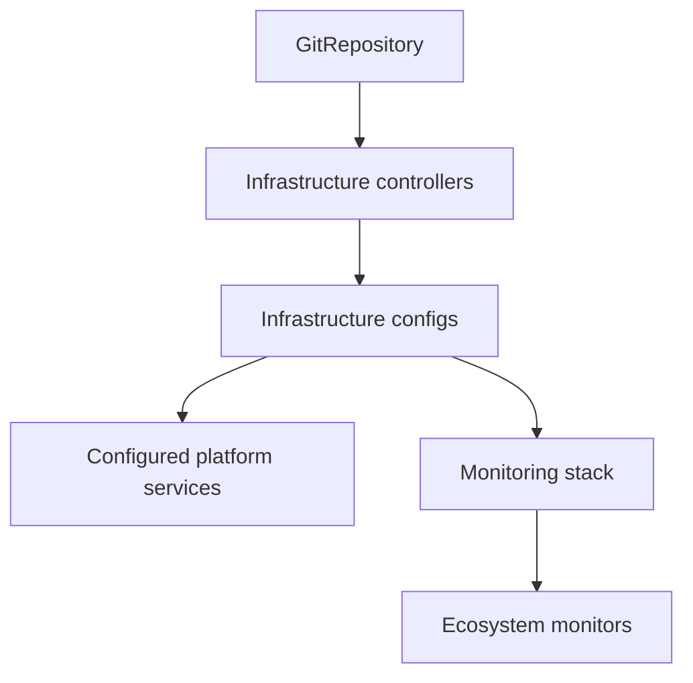

# Reconciliation

Flux watches this repository and applies the paths selected by the
Kustomizations under `gitops/clusters/lab`. A manifest is not live merely
because it exists; it must be reachable from one of those cluster entrypoints.

## Active layers

- `apps.yaml` reconciles user-facing workloads from `gitops/apps/lab`.
- `infrastructure-controllers.yaml` reconciles shared controllers from
  `gitops/infrastructure/controllers/lab`.
- `infrastructure-configs.yaml` reconciles environment configuration from
  `gitops/infrastructure/configs/lab` after the controllers are healthy.
- `monitoring-controllers.yaml` installs kube-prometheus-stack after
  infrastructure configuration is healthy and delivers the Grafana credential.
- `monitoring-configs.yaml` applies ecosystem monitors after the stack is
  healthy.

## Dependency ordering

The infrastructure configuration stage depends on the controller stage. This
ensures controllers such as External Secrets exist before their custom
resources are applied.



Dependency details live in the Flux Kustomizations under
`gitops/clusters/lab`. Use `dependsOn` and health checks there when ordering is
required; avoid encoding ordering only in documentation.

## Inspect reconciliation

```shell
flux get kustomizations
flux get helmreleases --all-namespaces
```

## Apply repository changes

Flux-owned resources should change through Git rather than a long-lived manual
`kubectl apply`. Commit and push the manifest change, then either wait for the
configured interval or request reconciliation immediately:

```shell
flux reconcile kustomization infrastructure-configs --with-source
```

A manual apply can help diagnose a manifest, but Flux will restore the version
from its Git source on the next reconciliation. Treat that behavior as drift
correction, not as a deployment failure.

Use the [Adding a service](adding-a-service.md) guide when wiring a new overlay
into one of these layers.
