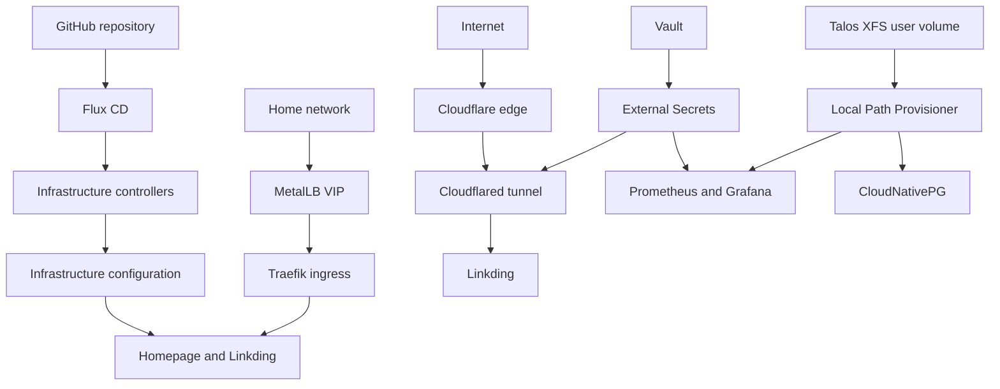

# Hyperoot Homelab

Welcome to a single-node Kubernetes platform built to make infrastructure
understandable, reproducible, and pleasant to operate. Talos Linux provides the
immutable host, Flux continuously reconciles this repository, and every active
application sits on a small set of shared platform services.

-   **Understand the platform**

    Start with the [architecture overview](architecture/platform.md) to see
    how Git, Flux, networking, secrets, and workloads fit together.

-   **Recreate the host**

    Follow the [platform setup](platform/index.md) to understand the Talos
    installation, NVIDIA host support, and local storage foundation.

-   **Explore what is running**

    Browse [applications](apps/index.md) and [platform services](services/index.md),
    with status, dependencies, configuration paths, and ownership on each page.

-   **Learn the GitOps model**

    Read the [GitOps overview](gitops/index.md) before changing manifests or
    adding a service.

-   **Operate the cluster**

    Use [runbooks](runbooks/index.md) for repeatable bootstrap, recovery, and
    credential-management procedures.

## Platform at a glance

## Current state

| Area | Status | Components |
|---|---|---|
| Platform | Active | Talos Linux, Kubernetes, Flux CD, NVIDIA GPU Operator, local storage |
| Networking | Active | MetalLB, Traefik, Cloudflared |
| Secrets | Active | Vault, External Secrets Operator |
| Applications | Active | Homepage, Linkding |
| Databases | Operator enabled | CloudNativePG is installed; no application database cluster exists yet |
| Monitoring | Active | Prometheus, Alertmanager, Grafana, and cluster exporters |

## How to read these docs

1. [Architecture](architecture/index.md) explains relationships across the
   whole platform.
2. [Platform setup](platform/index.md) explains the Talos host foundation.
3. [GitOps](gitops/index.md) explains how repository changes become live state.
4. [Applications](apps/index.md) documents user-facing workloads.
5. [Services](services/index.md) documents shared infrastructure components.
6. [Runbooks](runbooks/index.md) provides commands for operational procedures.

!!! note "Source of truth"
    These pages explain the current system. Flux manifests under `gitops/` and
    Terraform under `iac/` remain the operational source of truth.
