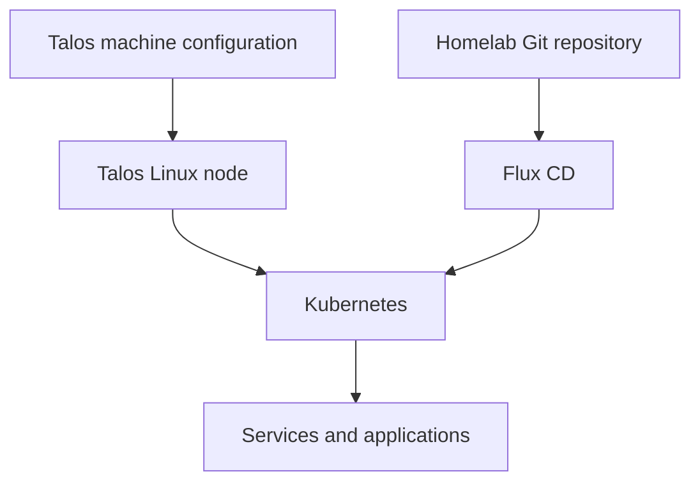

# Platform Setup

This section explains the host layer beneath Kubernetes: how Talos Linux was
installed, how the NVIDIA GPU became available to workloads, and how local
persistent storage was prepared during the same installation.

Talos machine configuration is maintained separately from this repository.
The separation is intentional:

- Talos configuration owns the operating system, kernel modules, node
  scheduling policy, and host storage mounts.
- This repository owns Kubernetes resources reconciled by Flux.
- Documentation here connects the two layers without publishing Talos
  credentials or generated machine configuration.

## Read in order

1. [Talos Linux](talos-linux.md) follows the complete `v1.13.6` single-node
   installation in execution order, including the NVMe storage layout.
2. [NVIDIA GPU](nvidia-gpu.md) explains why a custom Talos image and kernel
   modules were required before the Kubernetes GPU Operator could work.

After Talos creates and mounts the XFS user volume, the
[Local Path Provisioner](../services/local-path-provisioner.md) exposes it to
Kubernetes workloads through the `local-path` StorageClass.

The host was rebuilt from one validated `controlplane.yaml`. The custom
installer, NVIDIA modules, control-plane schedulability, `EPHEMERAL` limit, and
XFS user volume were not applied as later patches.
