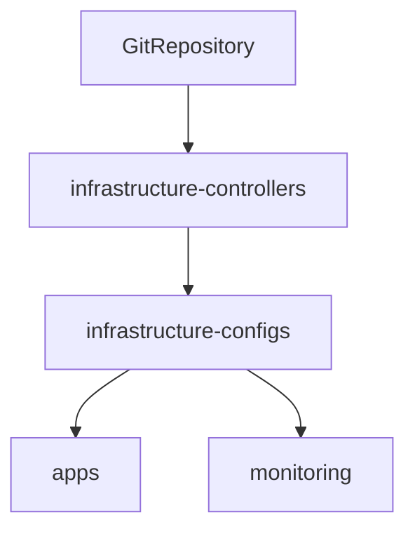

# Flux CD

Flux CD is the control loop that turns this Git repository into Kubernetes
state. It is installed through the Flux Operator and watches the `main` branch.

## Current implementation

| Property | Value |
|---|---|
| Distribution | Flux `2.x` |
| Source | `https://github.com/HYP3R00T/homelab.git` |
| Branch | `main` |
| Sync path | `gitops/clusters/lab` |
| Reconciliation interval | 1 minute for cluster Kustomizations |
| Network policy | Enabled |

Enabled controllers include source, Kustomize, Helm, notification, image
reflection, image automation, and source watcher.

## Reconciliation order

The monitoring Kustomization is healthy even though its overlay currently
contains no enabled resources.

## Repository locations

- Flux instance: `gitops/clusters/lab/flux-system/flux-instance.yaml`
- Cluster entrypoints: `gitops/clusters/lab`
- Controller overlays: `gitops/infrastructure/controllers/lab`
- Configuration overlays: `gitops/infrastructure/configs/lab`

See [Reconciliation](../gitops/reconciliation.md) for the change workflow and
drift behavior.
