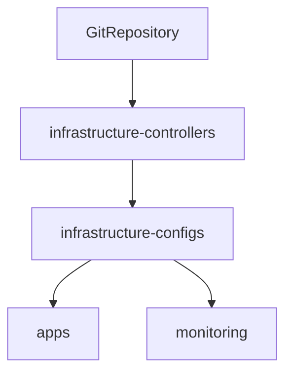

# Flux CD

Flux CD is the control loop that turns this Git repository into Kubernetes
state. It is installed through the Flux Operator and watches the `main` branch.

## Current implementation

| Property | Value |
|---|---|
| Distribution | Flux `2.x` |
| Source | `https://github.com/HYP3R00T/homelab.git` |
| Branch | `main` |
| Sync path | `gitops/clusters/lab` |
| Reconciliation interval | 1 minute for cluster Kustomizations |
| Network policy | Enabled |
| Web UI | `http://flux.homelab.internal` |

Enabled controllers include source, Kustomize, Helm, notification, image
reflection, image automation, and source watcher.

## Web UI

Flux Operator embeds its Web UI in the operator process and exposes it through
the `flux-operator` Service on the `http-web` port. The lab Ingress routes
`flux.homelab.internal` to that service through Traefik; no additional UI
deployment or persistent storage is required.

The current local-only endpoint uses the default anonymous, read-only access.
It can inspect Flux resources and workloads but cannot perform reconciliation,
suspend, resume, or restart actions. Do not add this hostname to the public
Cloudflare Tunnel without first configuring OIDC authentication and explicit
Kubernetes RBAC.

## Reconciliation order

The monitoring Kustomization is healthy even though its overlay currently
contains no enabled resources.

## Repository locations

- Flux instance: `gitops/clusters/lab/flux-system/flux-instance.yaml`
- Web UI Ingress: `gitops/infrastructure/configs/lab/flux-web`
- Cluster entrypoints: `gitops/clusters/lab`
- Controller overlays: `gitops/infrastructure/controllers/lab`
- Configuration overlays: `gitops/infrastructure/configs/lab`

See [Reconciliation](../gitops/reconciliation.md) for the change workflow and
drift behavior.

## References

- [Flux Operator Web UI](https://fluxoperator.dev/web-ui/)
- [Ingress configuration](https://fluxoperator.dev/docs/web-ui/ingress/)
- [User management](https://fluxoperator.dev/docs/web-ui/user-management/)
