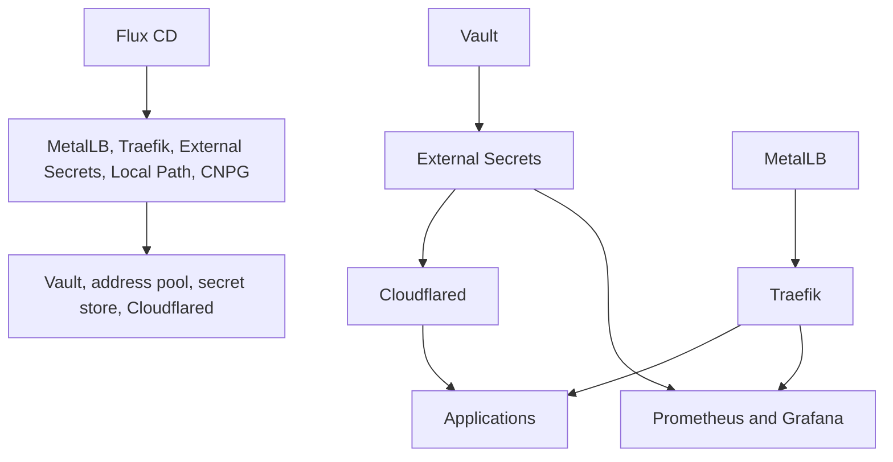

# Platform Services

Services provide capabilities shared by applications: reconciliation,
networking, secret delivery, external access, hardware enablement, databases,
and observability.

## Active services

| Service | Version | Responsibility | Managed here |
|---|---|---|---|
| [Flux CD](flux.md) | `2.x` | Reconciles Git into Kubernetes | Yes |
| [MetalLB](metallb.md) | `0.16.1` | Advertises the LAN load-balancer address | Yes |
| [Traefik](traefik.md) | Chart `41.x.x` | Routes local HTTP traffic | Yes |
| [Vault](vault.md) | Chart `0.34.0` | Stores sensitive values | Yes |
| [External Secrets](external-secrets.md) | Chart `0.20.3` | Synchronizes Vault values into Kubernetes | Yes |
| [Cloudflared](cloudflared.md) | `2026.7.1` | Connects public Cloudflare traffic to services | Yes |
| [NVIDIA GPU Operator](gpu-operator.md) | `v26.3.3` | Enables and validates GPU workloads | Yes |
| [Local Path Provisioner](local-path-provisioner.md) | `v0.0.36` | Dynamically provisions local persistent storage | Yes |
| [CloudNativePG](cloudnative-pg.md) | Chart `0.29.0` | Manages PostgreSQL clusters | Yes |
| [kube-prometheus-stack](kube-prometheus-stack.md) | Chart `87.15.2` | Collects metrics, evaluates alerts, and serves dashboards | Yes |
| [Metrics Server](metrics-server.md) | Chart `3.13.1` | Publishes recent resource usage through the Metrics API | Yes |

## Dependency shape

For procedures, use [Runbooks](../runbooks/index.md). For request and secret
paths, use [Architecture](../architecture/index.md).
